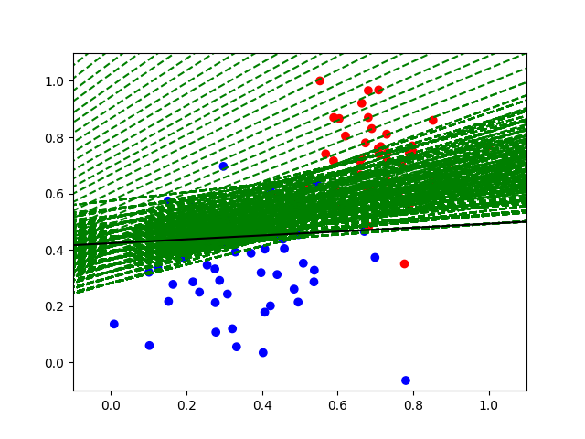

# CS580_Fall24_Joel_Collazo_HW4

## How to use the code..
> There are a few files that you can use...
>    NOTE: they all need "data.csv"
* make_graph.py
* perceptron_heuristic.py
* perceptron_gradient_descent.py
> You can run any of them to start the test run of the code and it will show the graph after the work is done 
> I have inculded some of my results from some tests so you can see what the data should look like 

## There is Images 
> i have added some images from desmos to verify and to
> make sure there is the proper output 

## make_graph.py

* Just the base graph will be displayed 

## perceptron_heuristic.py

* here is the test of the Perceptron Heuristic of what the ouput should be 

## perceptron_gradient_descent.py

* here is the test of the Perceptron Gradient Descent of what the ouput should be 

* Bounus here is another image to see the error curve for what the program does 

## PDF is also Included..
> There is also a PDF inclueded with more reading materail 
> to go over thoughts and images more in depth that can be
> usefull to learn more about what is going on with the programs